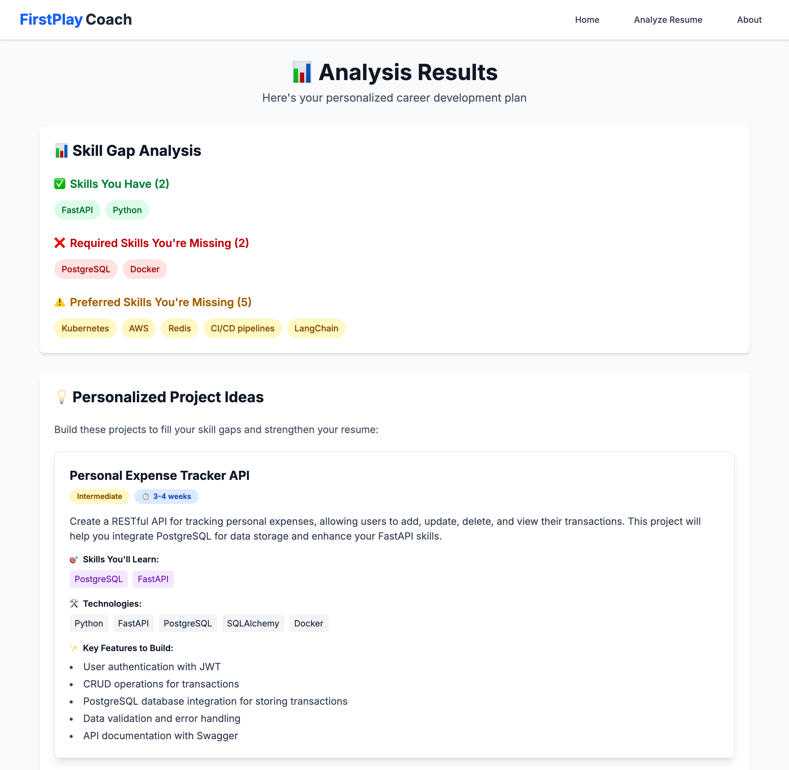
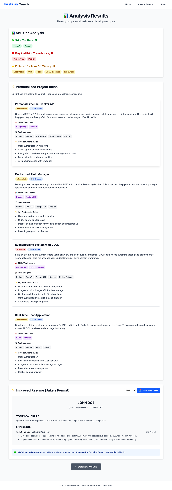
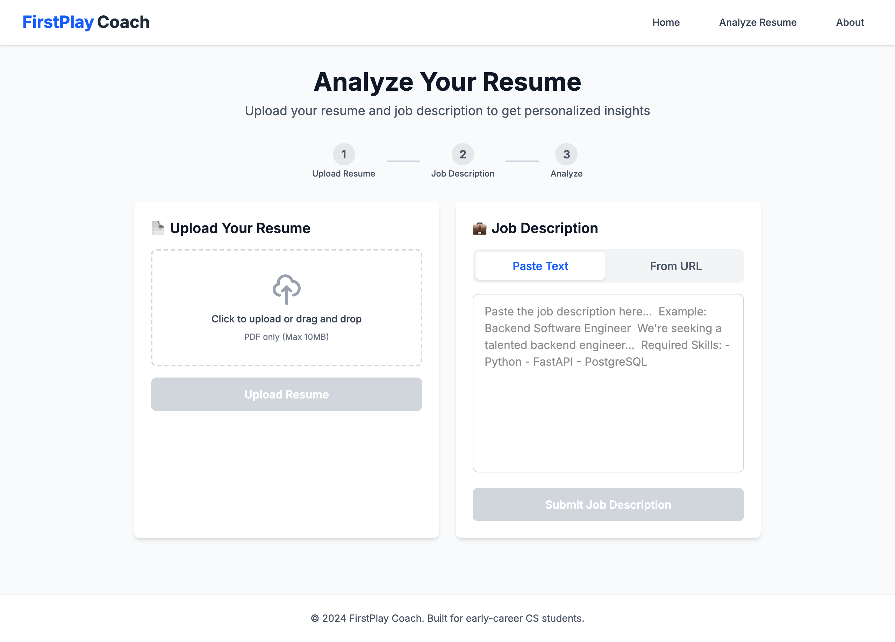
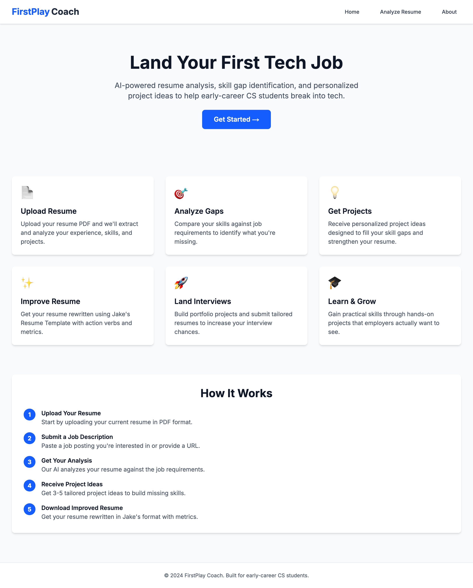

# FirstPlay Coach — Frontend

Next.js client for FirstPlay Coach, a tool that reads a student's resume against
a real job posting, shows which required skills are missing, and returns
portfolio projects that would close the gap plus a rewritten resume tailored to
that posting.

Built for early-career CS students, whose problem is usually not the resume's
wording but that the resume and the posting are describing different skill sets.

**Live:** https://firstplay-frontend.vercel.app

A real run against the live deployment — the resume's skills matched against a
backend engineer posting, and the first of four generated projects:



<details>
<summary>The full results page, and the rest of the flow</summary>

All four projects and the rewritten resume:



The analyze view, where a run starts:



The landing page:



</details>

**A full run takes about 13 seconds** — median of 9 timed runs against the live
deployment, range 11-16s, of which ~0.5s is the upload and job submission and
the rest is four sequential LLM calls. Add ~47s to the first request of the day,
while Render wakes the backend.

---

## What it does

1. **Upload a resume.** PDF only, checked client-side before upload.
2. **Add a job posting.** Paste the text, or give a URL for the backend to fetch
   and strip.
3. **Run the analysis.** One call to the backend's pipeline, which returns
   everything below in a single response.
4. **Read the results:**
   - **Skill gap** — which required and preferred skills the resume matches, and
     which it does not.
   - **Project ideas** — 3-5 projects targeting the missing skills, each with
     difficulty, an estimated duration, a tech list, and features to build.
   - **Improved resume** — rewritten in Jake's template, every bullet shaped as
     action verb + technical context + metric. Downloadable as **PDF**
     (generated in-browser with jsPDF) or **LaTeX** (`.tex`, ready for Overleaf).

---

## Tech stack

| | |
|---|---|
| Framework | Next.js 16 (App Router) |
| UI | React 19, TypeScript 5 |
| Styling | Tailwind CSS 4 |
| PDF generation | jsPDF 3 (client-side) |
| Fonts | `next/font` — Inter |
| Hosting | Vercel, auto-deploying from `main` |

No state library and no data-fetching library. The whole flow is three `fetch`
calls and `useState` in `app/analyze/page.tsx`, which is about the right amount
of machinery for three steps.

---

## How it connects to the backend

All analysis happens in [firstplay-backend](https://github.com/victorzhu443/firstplay-backend)
(FastAPI + LangGraph, deployed on Render). This app renders its output and holds
no logic of its own.

The base URL comes from `NEXT_PUBLIC_API_URL`, falling back to
`http://localhost:8000`:

```ts
const apiUrl = process.env.NEXT_PUBLIC_API_URL || 'http://localhost:8000';
```

Because the variable is `NEXT_PUBLIC_`, it is inlined into the client bundle at
build time, not read at runtime — **changing it in Vercel requires a redeploy**,
not just a restart.

Three endpoints are used, in order:

| Step | Call | Returns |
|---|---|---|
| 1 | `POST /api/resume/upload` (multipart `file`) | `resume_id` |
| 2 | `POST /api/job/description/manual` `{jd_text}` or `POST /api/job/url` `{url}` | `job_id` |
| 3 | `POST /api/pipeline/run` `{resume_id, job_id}` | gap analysis, projects, improved resume |

Errors come back as `{"detail": "..."}` and are surfaced to the user directly.

This app's Vercel domain must be present in the backend's CORS allowlist in
`app/main.py`, so a new domain needs adding there.

---

## Running locally

Requires Node 18+ and a running backend.

```bash
git clone https://github.com/victorzhu443/firstplay-frontend
cd firstplay-frontend
npm install

echo "NEXT_PUBLIC_API_URL=http://localhost:8000" > .env.local

npm run dev
```

Open http://localhost:3000. Follow the backend repo's README to get the API up
on port 8000 first — without it, uploads fail immediately.

```bash
npm run dev      # dev server
npm run build    # production build
npm run start    # serve the production build
npm run lint     # eslint
```

---

## Project layout

```
app/
├── layout.tsx              Nav, footer, fonts
├── page.tsx                Landing page
├── about/page.tsx          About
├── globals.css             Tailwind entry
├── analyze/page.tsx        The whole flow: upload → job → results
└── components/
    ├── ResumeUpload.tsx           Step 1
    ├── JobDescriptionInput.tsx    Step 2 (text / URL toggle)
    ├── GapAnalysisDisplay.tsx     Results: skill pills
    ├── ProjectIdeasDisplay.tsx    Results: project cards
    └── ImprovedResumeDisplay.tsx  Results: resume + PDF/LaTeX download
types/index.ts              Shared API response types
```

---

## Known issues

Recorded rather than left to be discovered.

**The progress message is wrong in both directions.** The analyze button reads
"This may take 20-30 seconds". A warm run actually finishes in about 13 seconds,
so the estimate undersells it — but the backend sleeps on Render's free tier and
takes ~47s to wake before any work begins, so a first request runs past a minute
with nothing on screen to explain the difference. One fixed string cannot
describe both. Waking the backend on page load, or showing which of the five
pipeline steps is running, would fit what actually happens.

**The API base URL is copy-pasted in three places.** `analyze/page.tsx`,
`ResumeUpload.tsx` and `JobDescriptionInput.tsx` each rebuild
`process.env.NEXT_PUBLIC_API_URL || 'http://localhost:8000'` inline. One shared
helper would do, and would give error handling a single home.

**Results are lost on refresh.** Everything lives in React state with no URL or
storage backing it, so a reload after a run means uploading and re-analysing
from scratch, at the cost of another four LLM calls.
